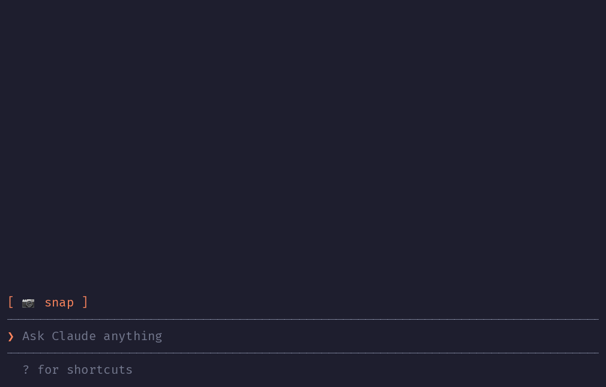

# Claude iPhone Cam

A Claude Code mod that lets Claude see what your iPhone camera sees. Press **📷 snap** above the prompt, check the thumbnail, type your question, send.



The terminal in the demo is drawn, the pies are real: photos by [Joe Dumas](https://unsplash.com/photos/89zuNmg6w0Y) and [Debby Hudson](https://unsplash.com/photos/IilbCWFsHMg) on Unsplash. Rebuild it with `demo/make.sh` (needs `agg`, `ffmpeg` and `python3`).

No AirDrop, no Telegram-to-yourself, no saving files. The iPhone is already a Mac webcam through [Continuity Camera](https://support.apple.com/en-us/102546); this mod grabs one frame from it.

## Install

Inside Claude Code, run:

```
/plugin marketplace add mikhin/claude-iphone-cam
/plugin install iphone-cam
/reload-plugins
```

## Requirements

- macOS Ventura or later, iOS 16 or later, iPhone XR or newer
- Both devices on the same Apple ID, Wi-Fi and Bluetooth on, iPhone locked and near the Mac
- `ffmpeg` (`brew install ffmpeg`)
- Camera access for your terminal app (macOS asks on the first snap)

## What you see

```
[ 📷 snap ]
❯ _
```

After a snap:

```
╭──────────────╮ goes with the next message
│   (frame)    │ [ retake ]
│              │ [ drop ]
╰──────────────╯
❯ is my pie done?
```

- **retake** snaps again, **drop** forgets the frame.
- On send the frame goes with your message and the band clears.

## How it works

1. `ffmpeg -f avfoundation -list_devices` finds the device named `… iPhone … Camera` (Desk View is skipped).
2. One `ffmpeg` run waits 1.5 s for exposure, then writes a full JPEG and a 640 px PNG thumbnail to `$TMPDIR/claude-cam/`.
3. The band above the prompt draws the thumbnail with Claude Code's `Image` element.
4. On send, a `prompt.submit` hook adds the JPEG's path to the message context, and Claude reads it.

A mod can only add text to a message, not image bytes, so Claude opens the frame with one `Read` call.

## License

MIT
